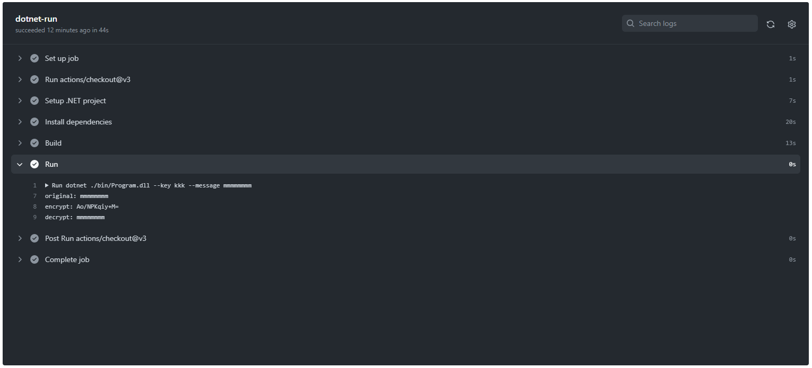

# simple-RC4

🗽🗽🗽 RC4暗号アルゴリズムをC#で実装してみた！  

  

## 実行方法

```shell
dotnet run --project ./src --key "暗号化キー" --message "メッセージ"
```

例えば、、、  

```shell
dotnet run --project ./src --key "HappyNewYear" --message "Hello World!!!"

original: Hello World!!!
encrypt: PHNPdryKIQ1Kp4gmZCQ=
decrypt: Hello World!!!
```

正しく暗号化・復号化できていることが確認できます。  

GitHub Actionsでも実行しています。  
`./.github/workflows/run.yml`の`dotnet-run`ジョブ内の`Run`ステップを参照してください。  

---

テストするには、、、  

```shell
dotnet test ./Tests
```
